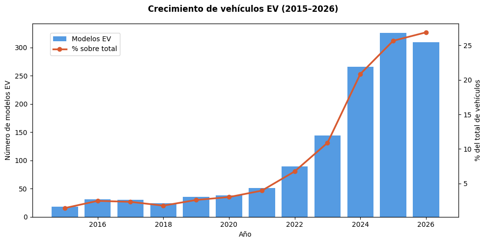
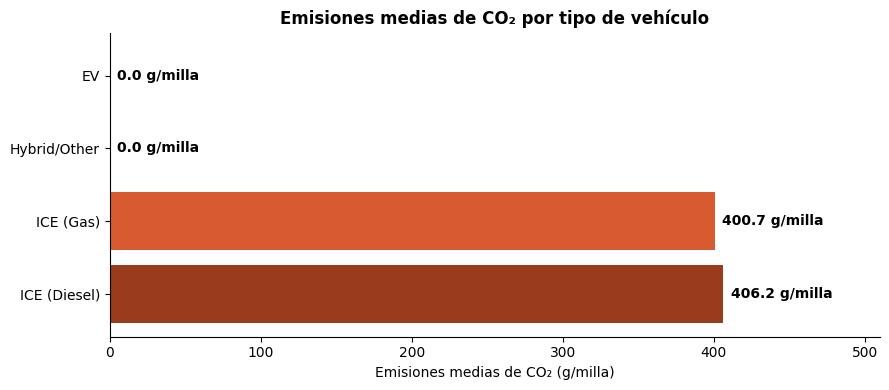
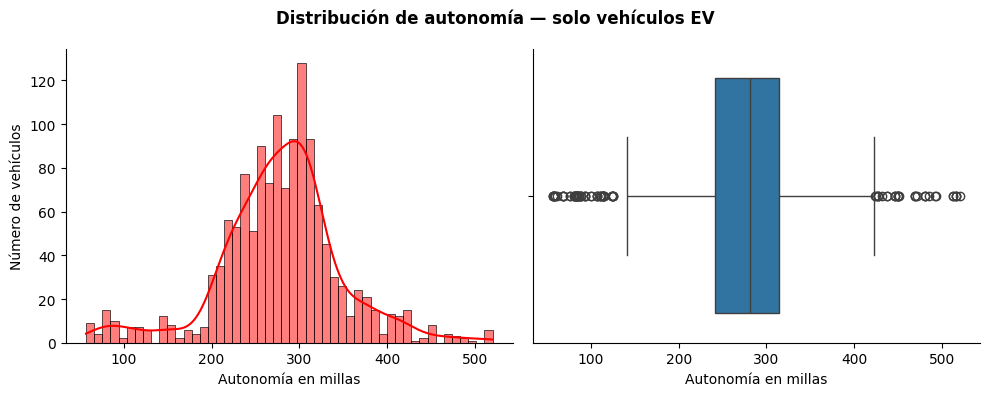

# ⚡🚗 EDA Vehículos Eléctricos vs Combustión


---

##  📖 Descripción del proyecto

Este proyecto consiste en un Análisis Exploratorio de Datos (EDA) enfocado en el estudio y comparación entre vehículos eléctricos, híbridos y de combustión.

El objetivo principal es analizar la evolución del mercado automovilístico, la eficiencia energética, las emisiones de CO₂ y el crecimiento de los vehículos eléctricos a lo largo del tiempo mediante técnicas de análisis de datos y visualización.

---

## ⚠️ Limitaciones

- El dataset recoge modelos certificados por la EPA (U.S. Department of Energy), no unidades vendidas.
- Los datos de 2025–2026 son modelos homologados pero pueden no estar en el mercado.
- Las emisiones CO₂ de los EV son 0 en el punto de uso, no en ciclo de vida completo.
- Sesgo geográfico hacia el mercado americano (EE.UU.).

---


## 🎯 Objetivos del proyecto

- Analizar el crecimiento de los vehículos eléctricos.
- Estudiar la evolución de las emisiones de CO₂.
- Comparar la eficiencia energética entre distintos tipos de vehículos.
- Evaluar la evolución de la autonomía eléctrica.
- Identificar fabricantes líderes en eficiencia y electrificación.
- Validar hipótesis mediante análisis estadístico.

---


## 🧪 Hipótesis planteadas

- Los vehículos eléctricos han aumentado significativamente con el tiempo.
- Los vehículos eléctricos generan menos emisiones de CO₂ que los vehículos de combustión.
- La autonomía de los vehículos eléctricos ha mejorado en los últimos años.
- Los vehículos híbridos presentan un consumo más eficiente.
- El tipo de vehículo influye significativamente en las emisiones y eficiencia energética.

---


## 📂 Dataset

**Plataforma de descarga:** [Kaggle](https://www.kaggle.com/datasets/iconicwasil/vehicle-specs-and-carbon-footprint-2015-2026)  
**Fuente original:** [fueleconomy.gov](https://fueleconomy.gov/) — U.S. Department of Energy / EPA  
**Método de obtención:** Web scraping sobre fueleconomy.gov

El dataset utilizado contiene información técnica y medioambiental de diferentes vehículos, incluyendo variables como:

- Fabricante
- Año
- Tipo de vehículo
- Consumo de combustible
- Emisiones de CO₂
- Tamaño del motor
- Autonomía eléctrica
- Eficiencia energética

---
## 📊 Visualizaciones principales

### 📈 Crecimiento de modelos EV (2015–2026)


### 🌍 Emisiones medias de CO₂ por tipo de vehículo


### 🔋 Evolución de la autonomía media EV

---

## 🛠️ Tecnologías utilizadas

- Python
- Pandas
- NumPy
- Matplotlib
- Seaborn
- SciPy
- Jupyter Notebook

---


## 📁 Estructura del repositorio

    EDA_Vehiculos_Electricos_vs_Combustion/
    │
    ├── README.md
    ├── main.ipynb
    ├── Memoria.pdf
    ├── Presentacion.pdf
    │
    ├── src/
    │   │
    │   ├── data/
    │   │   └── coches.csv
    │   │
    │   ├── img/
    │   │   └── graficos_generados/
    │   │
    │   ├── notebooks/
    │   │   └── notebooks_de_desarrollo/
    │   │
    │   └── utils/
    │       └── funciones_auxiliares.py

---


## ⚙️ Instrucciones de reproducción

1. Clonar el repositorio:
```bash
git clone https://github.com/terelopdel-sketch/EDA_Vehiculos_Electricos_vs_Combustion
```
2. Instalar dependencias:
```bash
pip install -r requirements.txt
```
3. Ejecutar el notebook principal:

jupyter notebook main.ipynb

---


<br><br>
## 📈 Principales conclusiones

- Los vehículos eléctricos crecieron un **+1.711%** entre 2015 y 2025, pasando de 18 modelos (1.45% del mercado) a 326 modelos (25.65% del mercado).

- Las emisiones directas de CO₂ de los EV son **0 g/milla**, frente a las **400.7 g/milla** de los ICE de gasolina y **406.2 g/milla** de los diésel, lo que supone una reducción del **100%** en emisiones en el punto de uso.

- La autonomía media de los vehículos eléctricos mejoró un **+85.5%**, pasando de **157 millas (253 km)** en 2015 a **292 millas (470 km)** en 2025. El récord lo ostenta el **Lucid Air** con **520 millas (837 km)**.

- Los vehículos híbridos son un **175% más eficientes** que los de gasolina (64.1 MPG vs 23.3 MPG), y destacan por ser más eficientes en ciudad (65.9 MPG) que en carretera (62.2 MPG) gracias al frenado regenerativo.

- Los EV son **4 veces más eficientes** energéticamente que los ICE de gasolina (93.8 MPGe vs 23.3 MPG).

- **Tesla** lidera con 177 modelos EV, seguido de Rivian (161) y BMW (131). Un total de **39 fabricantes** tienen al menos un modelo eléctrico, con el 67.4% de los modelos concentrado en el top 10.

- El test de **Mann-Whitney U** confirma que las diferencias entre categorías de vehículo son estadísticamente significativas (p < 0.001) en emisiones de CO₂, eficiencia energética y autonomía.

---


<br><br>
## 👩‍💻 Autor
### María Teresa López Delgado
- [GitHub]https://github.com/terelopdel-sketch